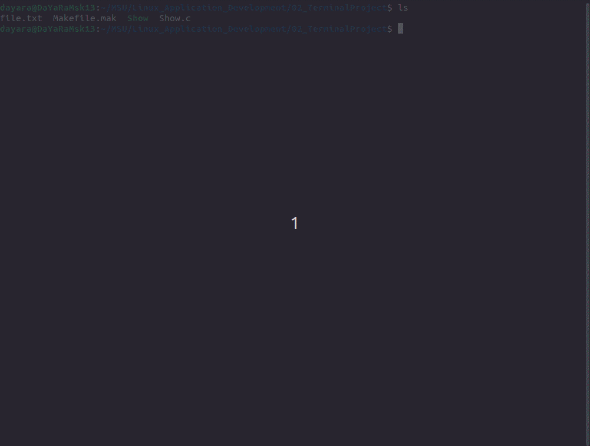

## Show.c program allows you to see your text file via terminal

#### Requirements:

* sudo apt-get install libncurses5w-dev

#### Start program

1) download makefile
2) to compile: make Show(cc Show.c -o Show -lncursesw)
3) to run program: ./Show [name of file]
4) to clean your space: make clean(rm -f *~ *.o Show a.out)

#### Presentation of program

