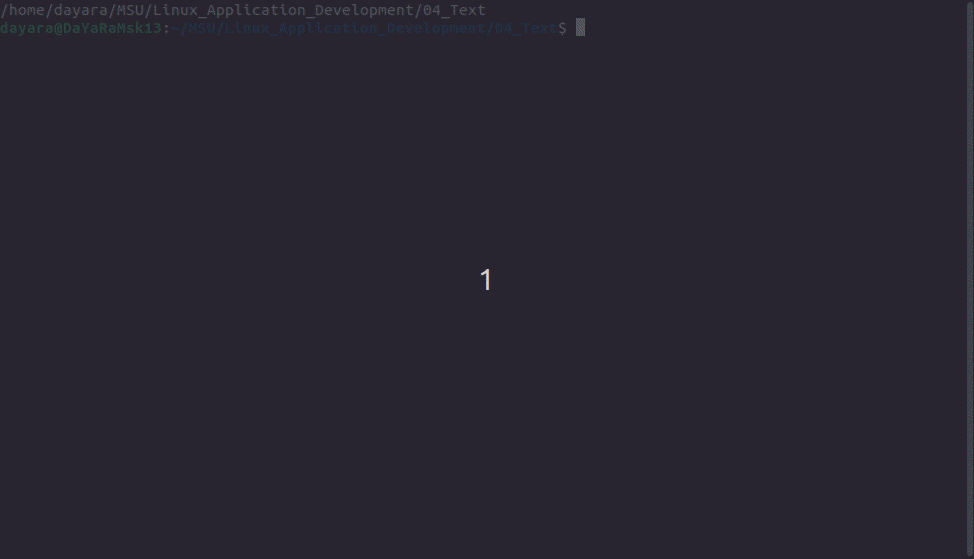

### Graceful outputing text

- Download all files in this catalog (from GitHub)

#### In your Linux terminal

- Use `LC_ALL=C {source of text} | ./randomize.sh [optional 1]`(optional 1 is responsible for delay time between output 2 characters)

- Look at exciting output

